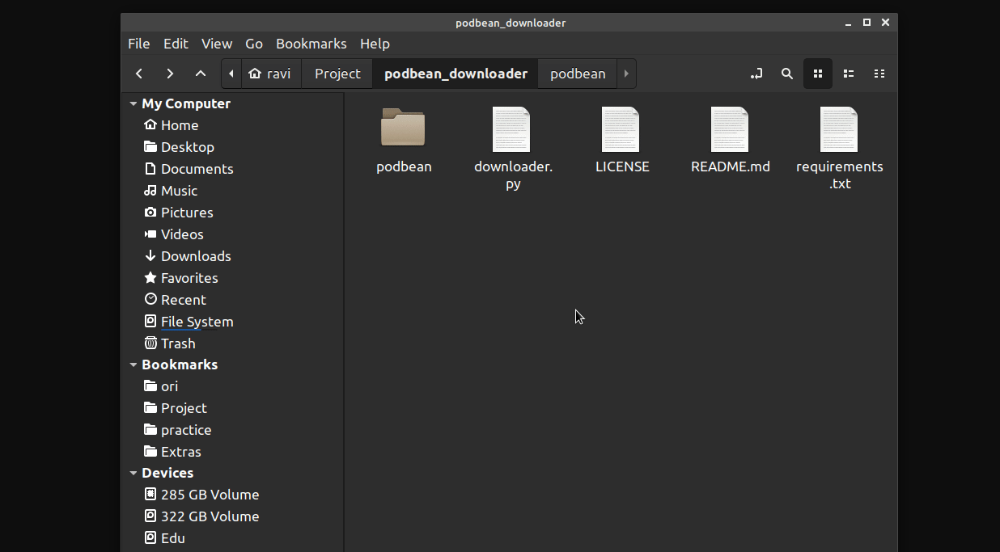

# Open terminal here - linux

This script opens terminal inside current directory we are viewing through the file manager.

Based on `PyAutogui`. 

Simple script just gets the work done.


### Setup
```
$ pip3 install - requirements.txt
$ chmod +x open_terminal_here.py
```
### Create shortcut in linux

> This guide is for Linux Mint
```
1. Go to keyboards
2. Open Shortcuts tab
3. Open Custom Shortcuts at the bottom
4. Click on Add custom shortcuts
5. Give the name to the custom shortcut
6. Paste the command - 
python3 /home/<user>/path_to_file/open_terminal_here.py
7. Assign a shortcut and save
```
